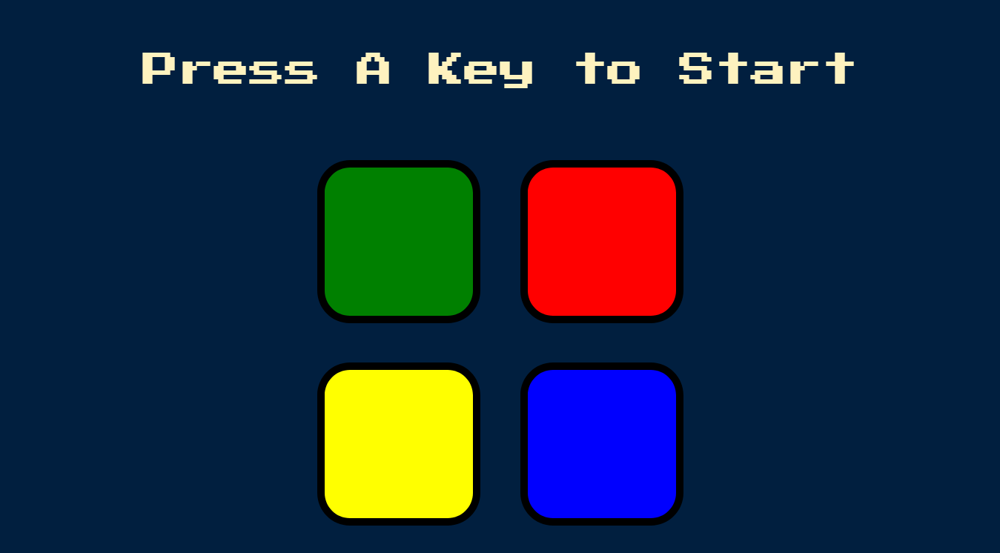

# Simon Game solution

## Welcome! 👋

This is a solution to the Simon Game challenge for the course [The Complete 2022 Web Development Bootcamp](https://www.udemy.com/course/the-complete-web-development-bootcamp/) on Udemy by Dr. Angela Yu.

## Table of contents

- [Overview](#overview)
  - [Screenshot](#screenshot)
  - [Links](#links)
- [My process](#my-process)
  - [Built with](#built-with)
  - [Notes](#notes)
- [Author](#author)
- [Acknowledgments](#acknowledgments)

## Overview

A perfect challenge if you've learned the fundamentals of HTML, CSS & JavaScript, completed a couple of smaller projects, and want to take it up a notch.

### Screenshot

### Links

- [Live Site URL](https://eyelin.github.io/simon-game/)

## My process

### Built with

- Semantic HTML5 markup
- CSS custom properties
- JavaScript
- JQuery

### Notes

- Built for desktop only, for now.

## Author

- Frontend Mentor Profile - [@Eyelin](https://www.frontendmentor.io/profile/eyelin)

## Acknowledgments

A big thank you to Dr. Angela Yu, Udemy and the community!
